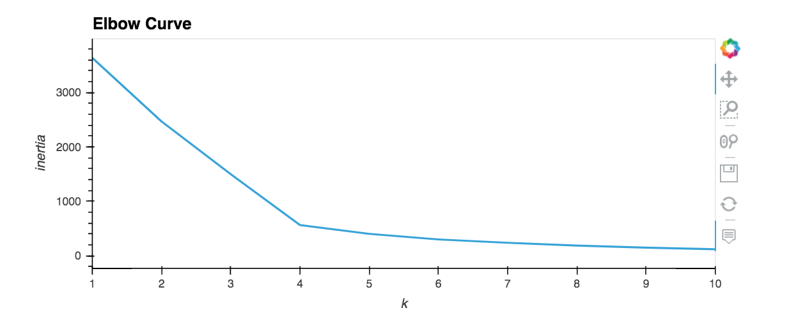
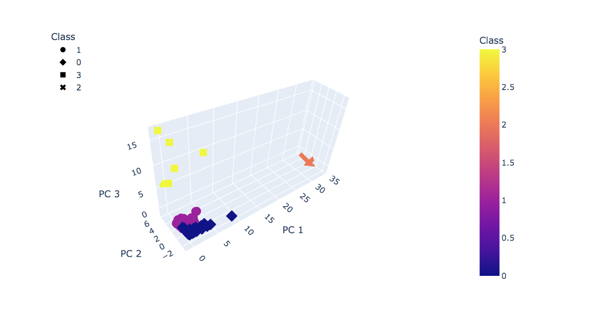
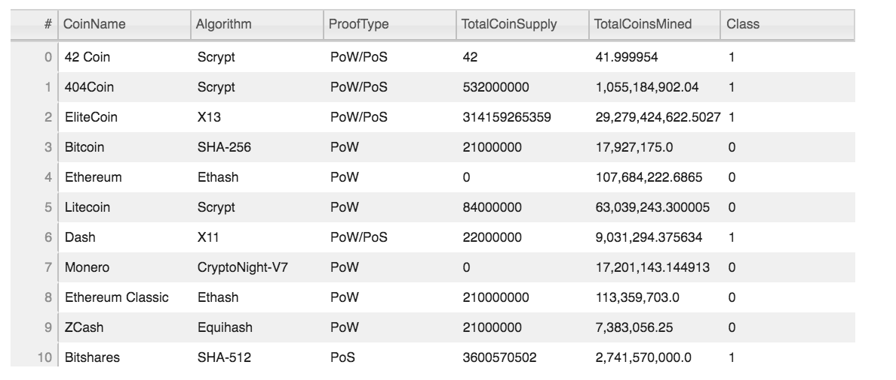
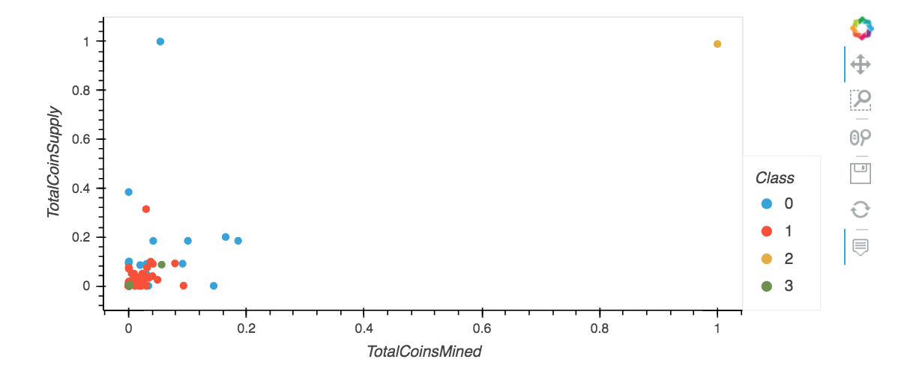

# Cryptocurrencies
Unsupervised learning techniques are used to explore trends in Cryptocurrencies.

532 Cryptocurrencies are classified into three different clusters. For more information, explore jupyter notebook file. But a visual summary is shown below:

